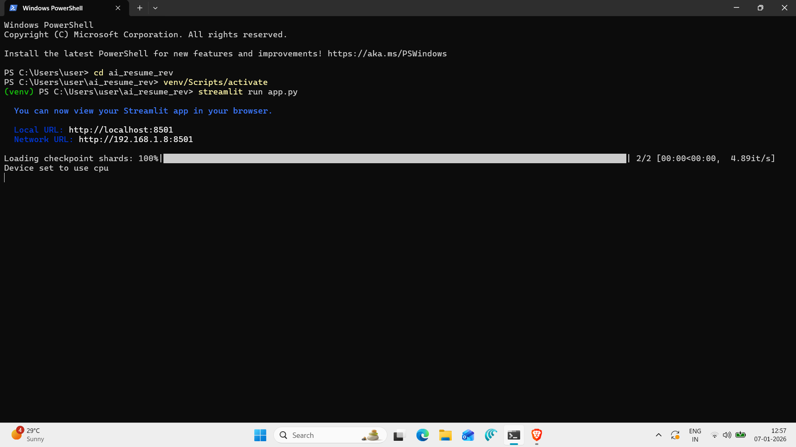
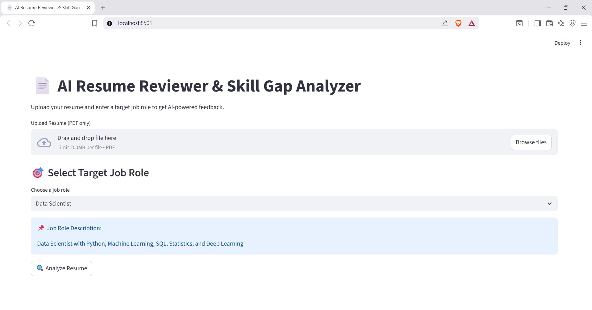
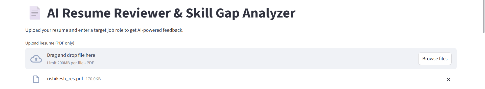
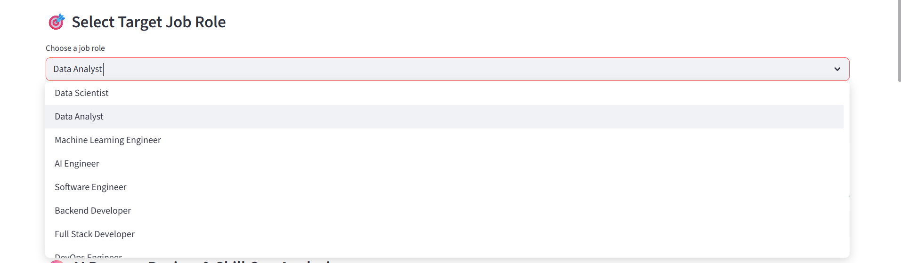
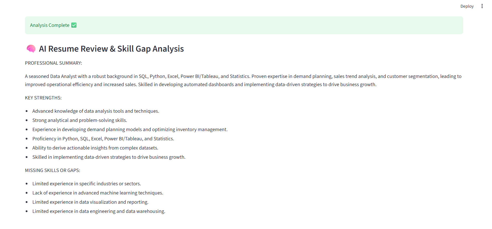

# AI Resume Reviewer & Skill Gap Analyzer (GenAI)
GenAI Resume Reviewer &amp; Skill Gap Analyzer using RAG
## 📌 Overview
The **AI Resume Reviewer & Skill Gap Analyzer** is a Generative AI application that analyzes a candidate’s resume against a target job role and provides **structured, actionable feedback**.

Unlike traditional keyword-based resume tools, this project uses **semantic understanding and Retrieval-Augmented Generation (RAG)** to evaluate resumes contextually and generate professional insights.

The system produces:
- Professional resume summary
- Key strengths
- Skill gaps
- Learning & improvement recommendations

---

## ❓ Problem Statement
Traditional resume evaluation methods are manual, subjective, and largely keyword-based. Candidates often lack clear feedback on how well their resumes align with specific job roles, making it difficult to identify skill gaps and improvement areas.

There is a need for an intelligent, context-aware system that can semantically analyze resumes and provide personalized, role-specific feedback.

---

## 💡 Solution
This project solves the problem by:
- Parsing resume PDFs into text
- Chunking the resume into meaningful sections
- Creating semantic embeddings
- Retrieving the most relevant resume sections for a given job role
- Using an instruction-tuned LLM to generate structured insights

The output is grounded in retrieved resume content to reduce hallucinations and improve relevance.

---

## 🏗️ System Architecture
1. User uploads a resume (PDF)
2. Resume text is extracted and chunked
3. Chunks are converted into semantic embeddings
4. Relevant chunks are retrieved using cosine similarity
5. Retrieved context is analyzed by an LLM
6. Structured feedback is displayed in the UI

---

## 🛠️ Tech Stack
- **Python**
- **Streamlit** – User Interface
- **PyPDF** – Resume text extraction
- **Sentence Transformers** – Semantic embeddings
- **Retrieval-Augmented Generation (RAG)**
- **Phi-3 Mini (Instruction-tuned Open-Source LLM)**
- **PyTorch / Transformers**

---

## ✨ Features
- Resume upload (PDF)
- Predefined IT job roles + custom role input
- AI-generated professional summary
- Identification of key strengths
- Skill gap detection
- Learning & improvement recommendations
- Progress indicator for long-running analysis
- Prompt instructions hidden from user output

---

## 👨‍💻 Example Job Roles
- Data Scientist
- Data Analyst
- Machine Learning Engineer
- AI Engineer
- Software Engineer
- Backend Developer
- Full Stack Developer
- DevOps Engineer
- Cloud Engineer
- Cyber Security Analyst

---

## ▶️ How to Run Locally

### 1. Create virtual environment
```bash
python -m venv venv
venv\Scripts\activate

### **2.** **Activate the virtual environment**
venv\Scripts\activate

### **3. Install required packages**
pip install -r requirements.txt

### **4. Run the application**
streamlit run app.py


## 📷 Screenshots

### Local Host


### Home Page


### Resume Upload


### Job Roles


### Final Output


## 🎥 Demo Video
[Click here to watch the demo](demo.mp4)


🚀 Future Improvements
-Use API-based or GPU-hosted LLMs for faster inference
-Downloadable resume review report (PDF)
-Resume scoring & ATS optimization
-Multi-resume comparison
-Separation of UI and inference layers for scalability

🧠 Key Learnings
-Practical implementation of RAG pipelines
-Prompt engineering for structured output
-Handling LLM latency on CPU
-Designing user-friendly GenAI applications
-Avoiding hallucination using retrieved context
